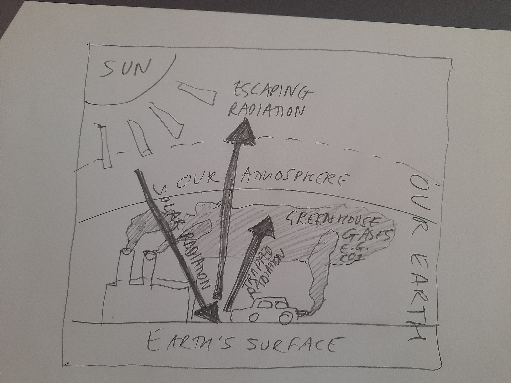
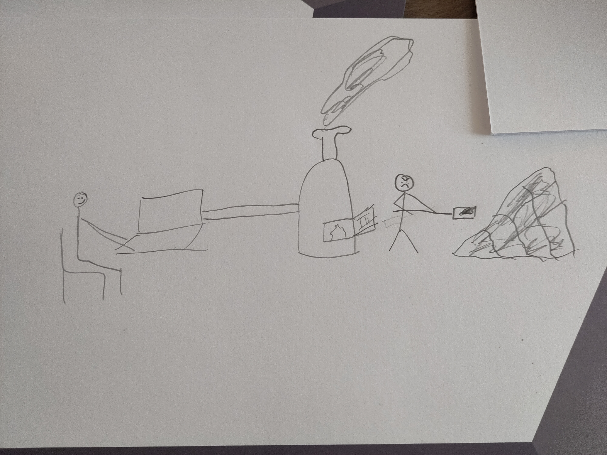

# Environmental Impact of research computing

# Introduction

The global climate crisis impacts all of us. From this, we know we should reduce our carbon emissions. However, if we do computing as part of our day-to-day work, it can form a significant part of our environmental impact, both for us personally and for our organisation(s). In particular, if you or your group does intensive computing, making use of high-performance computers or cloud resources, for example to train intricate models or run complex simulations, the carbon footprint can be sizable.

For this reason, it is important to consider the environmental impact of the computational work you and your colleagues and collaborators do, including having awareness of the possible scale of it in relation to other activities you undertake as part of day-to-day life. With this awareness, it follows that we should all aim to reduce our carbon footprint for our work activities.

This guide helps data and computational scientists to better understand the environmental impacts of their work and projects, as well as providing suggestions for reducing the impact of it.

The topic is not new, it has been discussed during CW23 [link to raspberry blog post, when it is available].

# Understanding the problem

Most of us are aware of the general context of our planet being subject to climate change that results largely from human influence, and how this poses a great threat to our society. However, in case you are not, and indeed to emphasise this crucial background, we’ll summarise this background.

## Climate change summarised

Human activities, notably the burning of fossil fuels like oil, gas or coal, to generate electricity and to power cars, amongst many other tasks, release greenhouse gases into the atmosphere. These gases, such as carbon dioxide, trap heat in the atmosphere, which in turn raises the temperature of the surface of the Earth. Over time, the global average temperature rises.

## Rise in global temperatures illustrated

The rise in this global average temperature is strikingly illustrated by the ‘Warming Stripes’ (‘#ShowYourStripes’) project, a minimalist-style data visualisation created by Ed Hawkins. Temperatures are indicated as stripes in blue hues, representing cooler temperatures, or red hues, representing warmer ones. The general trend shows a progression from there being more blue on the left (towards the past) to more red on the right (towards the present). In short, the planet is, overall, warming!

## Problems from such rising temperatures

Why should we be concerned about this rise in temperature?

... TBC!

# Awareness raising

To be completed

# Strategies for reduction

There are several things that can be done to reduce the environmental impact of research computing. In this section we describe some of the possible actions and links to external resources that can implement them.

These actions are not listed in any order of importance, and implementing any or all of them is better than not doing anything at all.

You can also see Ten simple rules to make your computing more environmentally sustainable [[https://journals.plos.org/ploscompbiol/article?id=10.1371/journal.pcbi.1009324](https://journals.plos.org/ploscompbiol/article?id=10.1371/journal.pcbi.1009324)] and the Digital Humanities Climate Coalition Toolkit [[https://sas-dhrh.github.io/dhcc-toolkit/](https://sas-dhrh.github.io/dhcc-toolkit/)]

## Improve code efficiency

As mentioned above, the amount of energy spent on running computation depends on how long the computation runs. One way of reducing the energy spent, is to optimize the code to make it run faster. 

Several studies show the energy intensity of computing tasks such as training 

Natural Language Processing models [[https://arxiv.org/pdf/1906.02243.pdf](https://arxiv.org/pdf/1906.02243.pdf), [https://dl.acm.org/doi/pdf/10.1145/3381831](https://dl.acm.org/doi/pdf/10.1145/3381831)], astrophysics simulations [[https://arxiv.org/pdf/2009.11295.pdf](https://arxiv.org/pdf/2009.11295.pdf)], bioinformatics [[https://academic.oup.com/mbe/article/39/3/msac034/6526403?login=false](https://academic.oup.com/mbe/article/39/3/msac034/6526403?login=false)], etc. 

Optimizing GPU code for energy efficiency is one way to reduce energy usage [[https://arxiv.org/abs/2211.07260](https://arxiv.org/abs/2211.07260)]

## Improve hardware efficiency

In some cases it is possible to run hardware in more energy efficient modes. One relevant example is the ARCHER2 national high performance computer service in the UK where three different CPU frequencies can be selected at run time. A 2022 study investigated the performance / power use trade off and discovered the power usage could often be reduced without noticeable alteration in the run time of most applications. As a consequence the service reduced the default frequency and updated the user-facing documentation in this area (see Turner, 2022).

For the Summit supercomputer it is known that about 63.8% of the power is consumed by GPUs [[https://doi.org/10.1007/s11227-020-03263-5](https://doi.org/10.1007/s11227-020-03263-5)].

## Avoid unnecessary tasks

Another way of reducing energy usage, is to avoid running task unnecessarily. Some examples include:

* Running CI[[https://the-turing-way.netlify.app/reproducible-research/ci/ci-options.html](https://the-turing-way.netlify.app/reproducible-research/ci/ci-options.html)] only when it is useful. For example: do not run unit tests when changes are made in the documentation and not on the code. 
* If you do test-driven development, run only tests that have previously failed. In this way you do not need to test code which you already know has been tested. You can use this GH action for limiting when tests (pytest) are run: [https://github.com/marketplace/actions/pytest-last-failed](https://github.com/marketplace/actions/pytest-last-failed) 
* Run CI with smaller datasets.

## Schedule tasks at low-emission time

Energy usage at different times of the day has different carbon intensity. This means that there is also an opportunity to reduce carbon emissions by running computing jobs at different times of the day. While the energy usage remains the same, the carbon intensity can be lowered in this way.

The Climate Aware Task Scheduler (CATS)[[https://github.com/GreenScheduler/cats](https://github.com/GreenScheduler/cats)]) has been built specifically with this in mind. This tool can calculate how much carbon will be emitted during the run of a specific task, look at the carbon emission forecast, and schedule the task to be run at a time when carbon intensity is low.

# References

* [https://www.green-algorithms.org/](https://www.green-algorithms.org/) 
* [https://onlinelibrary.wiley.com/doi/10.1002/advs.202100707](https://onlinelibrary.wiley.com/doi/10.1002/advs.202100707) 
* [https://www.nature.com/articles/s43586-023-00202-5.epdf?sharing_token=QTc-q5_jBfbwbgHrxjAF3NRgN0jAjWel9jnR3ZoTv0M5cDtvWq4NDOHdun0YacmqG8iEJ146ZGUvxIp3izWvG3qqEI0oN4e5AgJh1ioWOFtL_b-yexmwuBL7nKWggSD22xXBBQe-_M_1jL9gC5WNNOYCZkXrOcuiKp7L_6DvyMI%3D](https://www.nature.com/articles/s43586-023-00202-5.epdf?sharing_token=QTc-q5_jBfbwbgHrxjAF3NRgN0jAjWel9jnR3ZoTv0M5cDtvWq4NDOHdun0YacmqG8iEJ146ZGUvxIp3izWvG3qqEI0oN4e5AgJh1ioWOFtL_b-yexmwuBL7nKWggSD22xXBBQe-_M_1jL9gC5WNNOYCZkXrOcuiKp7L_6DvyMI%3D)
* [https://www.aclweb.org/anthology/P19-1355](https://www.aclweb.org/anthology/P19-1355) 
* [http://arxiv.org/abs/1907.10597](http://arxiv.org/abs/1907.10597) 
* [https://doi.org/10.1145/3442188.3445922](https://doi.org/10.1145/3442188.3445922) 
* [https://www.cdcs.ed.ac.uk/digital-humanities-climate-coalition](https://www.cdcs.ed.ac.uk/digital-humanities-climate-coalition)
* Carbon calculator: [https://www.wren.co/](https://www.wren.co/) 
* Turner (2022) Study of the impact of CPU frequency on ARCHER2: [https://www.archer2.ac.uk/news/2022/12/12/CPUFreq.html](https://www.archer2.ac.uk/news/2022/12/12/CPUFreq.html). ARCHER2 documentation [https://docs.archer2.ac.uk/user-guide/energy/](https://docs.archer2.ac.uk/user-guide/energy/) 

# Credits

This document draws on discussion from the Software Sustainability Institute’s Collaborations Workshop 2023 (CW23), and in particular on the “Raspberry” discussion and speed blogging session on “How do you track the environmental impact of computing?”. We thank all participants of CW23 for engaging around this topic.  
